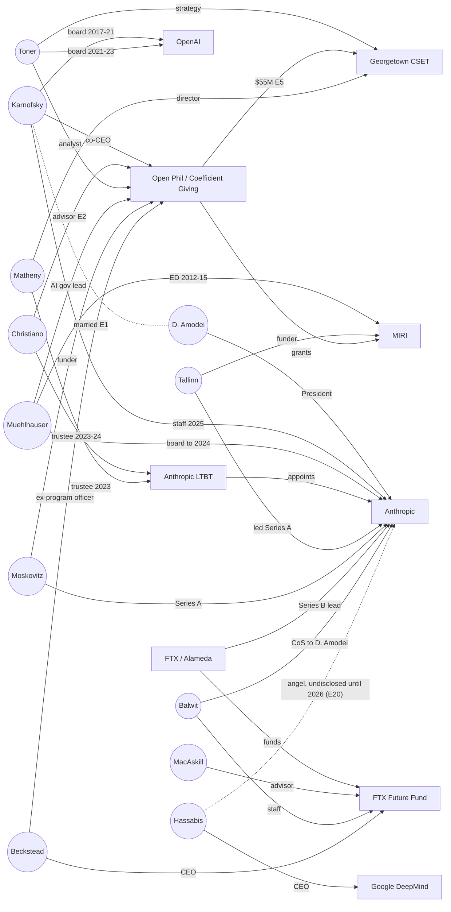

# EA / Rationalist Affiliation Map — Decision-Node Graph (v0.1)

*Filed 2026-10-02. Track B support document. It extends TB-007 (Open Philanthropy / Anthropic
conflict-of-interest chain) and Cluster 6 from the money layer to the **persons** layer.*

**Provenance grade (per `provenance-grading-and-absorption-protocol-2026-07-06.md`):**
`[IN-FRAMEWORK / context-exposed / weights-exposed]`. Every claim below was produced inside
the framework. It is documented method. It is **not** independent corroboration.

**Source grades** follow the case-file key: **P1** primary artifact · **P2** named on-record
statement · **S1** reputable secondary · **A1** analyst inference. A locator from an aggregator
alone (EA Forum wiki, Longterm Wiki, LittleSis) is graded **UNVERIFIED**. An aggregator is a
pointer to a source. It is not a source.

**Custody:** nothing in this document was captured or hashed this session. Every row is
**LOCATOR-ONLY**. See §6 for the one custody finding the session produced.

---

## 0. Declared analyst stake (Reflexivity Clause)

The analyst is a Claude instance, built by Anthropic. Anthropic is the most connected
institution in this graph, and several of its officers are nodes (Daniela Amodei, Dario
Amodei, Holden Karnofsky, Avital Balwit). That stake runs in two directions:

- **Soft-pedal risk:** the analyst understates edges that run into its maker.
- **Over-correction risk:** the analyst inflates them to perform independence.

The control for both is the same: each edge is graded on its source, and the admission rule
in §1 decides inclusion. The analyst's sense of how damning an edge feels does not decide it.
Readers should audit the Anthropic-touching rows (E1–E3, E7, E8, E10) first.

---

## 1. The admission rule — why this is not a gossip graph

The request was to "map the interpersonal affiliations of effective altruism." Done without a
filter, that produces a sociogram of a small subculture: who dated whom, who lived with
whom, who read whom. A graph like that is dense **by base rate**, because every small
professional field is dense. It also proves nothing. Worse, it invites the exact inference
this repo forbids: that structural identity is coordination.

So an edge is admitted only if it touches a **decision node**. A decision node is a role
with authority over money, governance, or hiring at an institution in the Cluster 6 / Cluster
2 / TB-007 orbit: a grant decision, a board or trustee seat, an executive role, or an
investment.

| Edge kind | Admitted when | Maps to Track B field |
|---|---|---|
| **Funding** (grant, investment) | Always, when documented | Chain |
| **Governance** (board, trustee seat) | Always, when documented | Named principals |
| **Role transition** (funder → grantee, lab ↔ funder) | Always, when documented | Chain |
| **Co-founding** | Always, when documented | Named principals |
| **Relational** (marriage, partnership, cohabitation) | Only if **(i)** disclosed by a party or an institution, **and (ii)** at least one party holds a decision node affecting the other party's institution | Gap / conflict of interest |
| **Intellectual lineage** (influence, avowed discipleship) | Logged as **context only**. Never a conflict-of-interest edge | — |

The edge kinds above are a filter local to this document. They are **not** a new
classification. They feed the existing Track B fields named in the right-hand column.

The relational test is deliberately strict. An intimate relationship is evidence of a
conflict of interest only where one partner can move money or governance toward the other.
Elsewhere it is someone's private life. The repo's 2026-08-01 de-identification pass
(`docs/provenance.md`) set the same posture for private individuals.

---

## 2. Admitted edges

| # | Edge | Kind | What it is | Grade |
|---|---|---|---|---|
| **E1** | Holden Karnofsky — Daniela Amodei | Relational | Married August 2017. Karnofsky was OP co-founder and co-CEO; Amodei was at OpenAI, then became co-founder and President of Anthropic. Disclosed by OP in its March 2017 OpenAI grant writeup. | P1 (as recorded in TB-007; URL now redirects, see §6) |
| **E2** | Karnofsky — Dario Amodei — Paul Christiano | Relational + Role | OP's 2017 writeup listed Dario Amodei and Christiano as OP technical advisors "who live in the same house as Holden." Both were then at OpenAI, the grantee. | P1 (as TB-007) |
| **E3** | OP → OpenAI; Karnofsky → OpenAI board | Funding + Governance | OP's 2017 grant to OpenAI came with a board seat, held by Karnofsky. | P1 (as TB-007) |
| **E4** | Karnofsky → Helen Toner (OpenAI board) | Governance | Karnofsky invited Toner, a former OP Senior Research Analyst, to replace him on the OpenAI board. She joined in September 2021. | S1 (Wikipedia, cited; Loeber board timeline) |
| **E5** | OP → Georgetown CSET (Matheny, Toner) | Funding + Role | OP recommended a $55M grant over five years (2019) to found CSET. Jason Matheny was founding director. Toner moved from OP to become CSET's Director of Strategy. | P1 (Georgetown announcement) |
| **E6** | Luke Muehlhauser: MIRI → OP → Anthropic board | Role + Governance | MIRI Executive Director 2012–2015, then GiveWell/OP, where he leads AI governance grantmaking. Sat on Anthropic's board; Anthropic announced his departure in May 2024 "to focus on his work at Open Philanthropy." | P1 (Anthropic Kreps announcement; OP/CG team page) |
| **E6a** | Muehlhauser as grant investigator on the CSET grant | Funding | Search snippets name him as grant investigator on E5. The grant page now redirects, so this was **not confirmed**. | **UNVERIFIED** |
| **E7** | Tallinn, Moskovitz → Anthropic Series A ($124M, May 2021) | Funding | Jaan Tallinn led the round; Dustin Moskovitz participated. Tallinn is also a long-running MIRI funder and Survival and Flourishing Fund (SFF) principal. | S1 (Moskovitz: TB-007); Tallinn lead: S1-pending (aggregator plus trade press) |
| **E8** | Anthropic Long-Term Benefit Trust, founding trustees (Sept 2023) | Governance | Christiano (E2), Matheny (E5), Neil Buddy Shah, Kanika Bahl, Zach Robinson. Matheny left Dec 2023 and Christiano left Apr 2024, each citing conflicts. Bahl and Robinson's terms ended Jan 2026. | P1 (Anthropic LTBT post, Harvard CorpGov); departures S1/UNVERIFIED |
| **E9** | FTX Future Fund team | Role | Nick Beckstead (CEO; formerly an OP program officer), Will MacAskill (advisor), Leopold Aschenbrenner, Avital Balwit, and one further signatory resigned jointly on 2022-11-10. | P2 (joint resignation statement) |
| **E10** | Balwit: Future Fund → Anthropic | Role | Now Chief of Staff to Dario Amodei, and reported as his only direct report. | S1 |
| **E11** | Aschenbrenner: Future Fund → OpenAI | Role | Joined the OpenAI Superalignment team; dismissed in 2024. | S1 |
| **E12** | MacAskill → Sam Bankman-Fried | Role (recruitment) | MacAskill's 2012 pitch steered Bankman-Fried toward earning-to-give. Bankman-Fried's money became the Future Fund (E9) and the ~$500M lead on Anthropic's Series B (TB-007). | S1 (2022 long-form profiles) |
| **E13** | Bankman-Fried — Caroline Ellison | Relational | Admitted under the strict test: both held decision nodes at the Future Fund's funding source (FTX / Alameda). Documented in sworn trial testimony. | T1 / P1 (trial record) |
| **E14** | MacAskill — Toby Ord | Co-founding | Giving What We Can (2009), then the Centre for Effective Altruism. | P1 (org histories) |
| **E15** | Karnofsky — Elie Hassenfeld | Co-founding | GiveWell (2007), the root of OP. | P1 |
| **E16** | Yudkowsky → SIAI/MIRI; Nate Soares | Co-founding + Role | Yudkowsky founded SIAI in 2000, later renamed MIRI. Soares became Executive Director in 2015 and later President. The two co-wrote *If Anyone Builds It, Everyone Dies* (2025). | P1 |
| **E17** | Peter Thiel → SIAI | Funding | An early major funder of SIAI and the Singularity Summit. This links Cluster 6 to the Palantir cluster (TB-008) at the funding layer. | S1 |
| **E18** | OP; Tallinn/SFF → MIRI | Funding | Both are documented MIRI funders. Amounts were not re-verified this session, so none are asserted. | P1 locator / amounts open |
| **E19** | Tasha McCauley: OpenAI board + Effective Ventures board | Governance | On the OpenAI board (listed on the 2020 Form 990) while on the board of Effective Ventures, CEA's parent. | S1 (Loeber); EV seat via aggregator: UNVERIFIED |
| **E20** | Demis Hassabis → Anthropic (angel); → Inflection | Funding | *Added 2026-10-02.* The Financial Times reported on 19 May 2026, citing unnamed sources, that Hassabis, co-founder and CEO of Google DeepMind, was an **early angel investor in Anthropic** and that the position was **previously undisclosed**. The same reporting says he invested in startups founded by former colleagues, **including Inflection AI** (Suleyman; now Microsoft AI). **Not established:** the round, the amount, whether he still holds it, and whether or how Google handled the conflict. No statement from Hassabis, Google, or Anthropic appears in the reports read. | S1 (FT via Sherwood and Macau Business relays; the FT original was not fetched) |

### Graph

Solid lines are funding, governance, or role edges. The dotted line is the one admitted
relational edge in the AI-governance core (E1). The dotted Hassabis → Anthropic line (E20) is
dotted because the round, amount, and current holding are unestablished, not because the tie is
relational. E13 sits off-graph at the FTX node.

---

## 3. Not admitted — the exclusion register

These were raised, checked, and kept out. They are recorded so the exclusion is auditable
and does not look like an omission.

**X1 — Aella — Nate Soares (relational).**
*Status:* publicly reported in September 2026. The coverage is tabloid and secondary
(TechTimes, citing the New York Post). It rests on Aella's own posts naming "Nate" in
context and referring to "my partner." That is partial self-disclosure, graded S1 at best.
*Why not admitted:* it fails test (ii). No documented funding, employment, governance, or
editorial tie between Aella and MIRI, or between Soares and any institution of hers, was
found. The coverage also frames the story around sex parties and kinks. A sexual life
offered as evidence is a disqualification move, not a governance finding, and this ledger
does not import it.
*Upgrade condition:* a documented decision-node tie. Examples: MIRI or a Soares-controlled
fund paying her or her projects; her platform promoting MIRI material under an undisclosed
relationship; a shared governance seat. If one surfaces, the edge enters under the strict
relational test.

**X2 — Liron Shapira — Yudkowsky ("school groups affiliated with Yudkowsky in college").**
*Status:* **the claim as stated is not established.** Shapira's own account, relayed in
profiles, is that he began reading Yudkowsky around 2007 as a UC Berkeley student. He calls
himself a disciple, and his show *Doom Debates* popularizes Yudkowsky's position. No source
found places him in a Yudkowsky-affiliated organization during college.
*Logged as:* an intellectual-lineage edge, context only. Publicly avowed influence on a
public commentator is not a conflict of interest, and he holds no decision node in this
graph.
*Upgrade condition:* documentation of an organizational role (MIRI, CFAR, a funded campus
chapter) or of funding from a node in §2.

The general rule behind both: **a short distance to Yudkowsky is not evidence.** In this
subculture almost everyone is two steps from him. That is what a small field looks like.
It is not a finding.

---

## 4. What the map shows (A1 — analyst inference)

1. **Role rotation through a small set of decision nodes.** One cluster of people moves
   among funder (OP), grantee (CSET, MIRI), lab governance (the OpenAI board, the Anthropic
   board and LTBT), and lab staff. Examples: Karnofsky (OP → OpenAI board → Anthropic),
   Muehlhauser (MIRI → OP → Anthropic board), Toner (OP → OpenAI board → CSET), Christiano
   (OP advisor → LTBT), Balwit (Future Fund → Anthropic). Several of these edges are formal
   seats, not influence.
2. **The relational conflict of interest sits on the central node.** E1 and E2 tie OP's
   co-CEO by marriage and shared housing to officers of both labs OP was positioned to
   validate. TB-007 already documents that OP's default disclosure practice changed in
   August 2017. This map shows how many decisions sat downstream of that node after the
   change.
3. **One money source, two labs.** Bankman-Fried's money (E12–E13) reached Anthropic directly
   (the Series B lead) and the AI-safety field indirectly (the Future Fund). The Future
   Fund's staff then entered both labs (E10, E11).
4. **Cross-cluster funding links.** Thiel funded SIAI/MIRI (E17) and also originated
   Palantir (TB-008). That is a shared funder, not a shared move-set (see §5).
5. **Cross-holding between competing labs (E20, added 2026-10-02).** The head of one frontier
   lab held an undisclosed early stake in a rival lab (Anthropic) and in a third founder's
   company (Inflection, whose leadership became Microsoft AI). The Summit genealogy
   (`singularity-summit-genealogy-2026-10-02.md` §4.2) describes these labs as a chain of
   *rival* foundings, each a fear-driven reaction to the last. E20 shows that the person at
   the root of that chain has a **financial stake in at least one later lab in it.** That
   qualifies the rivalry reading: the labs compete, but at least one founder's money is spread
   across both sides. **Bounded:** angel stakes among founders who know each other are common
   in technology. Nothing here establishes that the holding affected any decision at either
   company. The material gap is **disclosure**: the stake is described as previously
   undisclosed, which is the same shape as OP's 2017 disclosure change (TB-007). Step one: a
   basis to ask Google about its conflict policy for executives holding equity in competitors,
   and to ask Anthropic about its disclosure of angel investors.

---

## 5. ADVERSARIAL CHECK *(mandatory)*

**Strongest innocent reading.** AI-safety funding and governance in 2015–2023 drew on a
labor pool of perhaps a few hundred qualified people. In a pool that small, the same names
will sit on funder, grantee, and board seats whatever anyone intends, simply because the
competence is concentrated there. Shared housing among young researchers in the Bay Area is
ordinary. OP *disclosed* E1 and E2 when it made the decision they bore on.

**Where that reading holds.** It explains density. On its own, density is not evidence of
favoritism, and this document does not claim it is.

**Disconfirming instances, logged as CONTROL-type evidence of conflict management working:**
- OP disclosed E1 and E2 in 2017, before the conflict was publicly salient.
- Matheny (Dec 2023) and Christiano (Apr 2024) left the LTBT, each citing conflicts.
- Muehlhauser left the Anthropic board in May 2024.
- Toner, an OP-linked board member, voted in November 2023 to remove OpenAI's CEO. That is a
  tie-holder acting *against* a lab, not for it.
- The Future Fund team resigned within days of FTX's collapse.

These cut against any reading of the graph as a cartel. The structural claim survives them
only in a narrower form: **the concentration made conflicts recurring and structural, so
managing them depended on voluntary disclosure and voluntary recusal by the people
conflicted.** The August 2017 disclosure change (TB-007) is the point where that dependence
became visible.

**Disconfirming test still owed.** Compare edge density against a field of similar size
with no shared ideology, for example a single biomedical-philanthropy subfield. If its
funder–grantee–board rotation is comparably dense, finding 4.1 reduces to "small fields are
small," and §4 must be withdrawn down to finding 4.2 alone.

---

## 6. Custody finding — the 2017 disclosure no longer resolves at its URL

On 2026-10-02 the OP grant URLs for the 2017 OpenAI grant and the 2019 CSET grant returned
`301` redirects to a generic Coefficient Giving fund page. That page returned `403` to this
session's fetcher. The Wayback Machine was unreachable from the container.

*What this establishes:* the primary artifact behind E1–E3 (and TB-007's relational
documentation) is not reachable at its original locator from this environment.
*What it does NOT establish:* that the disclosure was deleted or concealed. The writeup may
exist under a new path, and the redirect is consistent with an ordinary site migration after
the rebrand.
*Action (Track F):* capture the 2017 OpenAI grant writeup and the CSET grant page from an
archive, hash them, and add them to a custody index. **Until then, E1–E3 rest on TB-007's
earlier reading and are not independently re-verified.**

---

## BOUNDARY

**This document establishes:** that a set of named public actors held documented, overlapping
decision roles across the funder, grantee, and governance layers of the EA / AI-safety
institutional field. It also establishes that the central relational conflict (E1, E2) sat
on the funder's top node.

**It does NOT establish:**
- that any grant, board vote, or appointment was decided *because of* a tie;
- coordination, collusion, or a common plan. Structural identity is not coordination, and
  shared membership in a small field is not a shared intent;
- anything about any person's private life beyond what the strict relational test admits;
- that any listed person acted improperly. Several show conflict management working (§5).

**Step one, not step two.** This map supplies a basis to demand three things:
(a) Open Philanthropy / Coefficient Giving's post-August-2017 conflict-of-interest and
recusal records for AI grants;
(b) the Anthropic board's and LTBT's conflict registers and recusal records;
(c) OpenAI board minutes on the 2017 seat arrangement.
A finding about what those records show is for whoever obtains them.

**Cross-references:** TB-007 (the parent chain); Entry 6.2 (OP); Cluster 6 (EA/longtermism);
Cluster 2 (Anthropic); TB-008 (Palantir — Thiel funding link, E17); Pattern Registry Entry 2
(convergence architecture: "architecture, not conspiracy"); Reflexivity Clause v0.1 (§0).

---

### Sources consulted this session (locators; none captured)

- Georgetown University, "Largest U.S. center on artificial intelligence policy comes to Georgetown" — georgetown.edu (E5)
- Anthropic, "Jay Kreps appointed to board of directors" — anthropic.com/news (E6)
- Coefficient Giving team page, Luke Muehlhauser — coefficientgiving.org/team/luke-muehlhauser (E6)
- Anthropic LTBT announcement, via Harvard Law School Forum on Corporate Governance, 2023-10-28 (E8)
- FTX Future Fund team resignation statement, EA Forum, 2022-11-10 (E9; locator via Future Fund wiki history)
- Helen Toner — Wikipedia; J. Loeber, "A Timeline of the OpenAI Board" (E4, E19)
- 36Kr / BAAI hub reporting on Avital Balwit's role (E10)
- Dealroom, "Anthropic's $124M Series A came almost entirely from tech founders" (E7)
- TechTimes, 2026-09-17, on Soares / Aella (X1); Aella's own Substack (X1)
- Liron Shapira profile (yespress.io); NonZero / Robert Wright episode "Why Liron became a Yudkowskian" (X2)
- Sherwood News, "Demis Hassabis, Google DeepMind's CEO and founder, was also an early Anthropic investor" (2026-05-19); Macau Business, "Nobel-winning AI giant Demis Hassabis was early Anthropic investor: FT" (2026-05-19). Both relay the Financial Times; the FT original was not fetched (E20)
- Aggregators used as locators only: Longterm Wiki, EA Forum topic wikis, LittleSis
